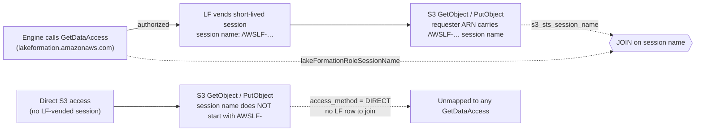

# Querying Audit Data

The value of auditing comes from **correlating** the Lake Formation authorization events ([`GetDataAccess`](lake-formation-cloudtrail.md)) with the S3 records of the objects that were actually read or written ([CloudTrail S3 Data Events or S3 Server Access Logs](s3-audit-events.md)). Most teams do this with Amazon Athena — either on demand, or on a schedule that materializes a curated audit table for dashboards and alerting.

The two queries below stitch the two sides together. Use the first if you capture S3 access with **CloudTrail S3 Data Events**, and the second if you use **S3 Server Access Logs**.

!!! note "Substitute your own table names"

    The queries reference example Athena table names built from the account ID `111122223333` (for example `cloudtrail_logs_aws_cloudtrail_logs_111122223333_us_east_2` and `s3_access_logs_2026_07`). Replace them with the names of the Glue Data Catalog tables over your own CloudTrail, S3 Data Event, and S3 Server Access Log locations.

## Query 1 — CloudTrail S3 Data Events joined to Lake Formation

```sql
-- s3_access: one row per S3 object operation, from the CloudTrail S3 data events.
with s3_access as (
    select
        eventtime as s3_eventtime,
        -- Reconstruct the full s3:// path from the request parameters.
        concat('s3://', json_extract_scalar(requestparameters, '$.bucketName'), '/',
            json_extract_scalar(requestparameters, '$.key')) as s3_object_path,
        -- Access made under a Lake Formation-vended credential carries a session name
        -- beginning 'AWSLF-'. Anything else is direct (non-LF) S3 access.
        case
            when starts_with(reverse(split(reverse(useridentity.arn), '/')[1]), 'AWSLF-') then 'LF'
            else 'DIRECT'
        end as access_method,
        eventid as s3_eventid,
        -- Resolve the underlying IAM identity (the role, not the transient session).
        case
            when useridentity.type = 'IAMUser' then useridentity.arn
            when useridentity.type = 'AssumedRole' then useridentity.sessioncontext.sessionissuer.arn
            else null
        end as s3_iam_arn,
        useridentity.arn as s3_sts_arn,
        -- Extract the session name (last '/'-delimited segment of the ARN). This is the
        -- key we join on: it matches lakeFormationRoleSessionName on the LF event.
        reverse(split(reverse(useridentity.arn), '/')[1]) as s3_sts_session_name,
        sourceipaddress as s3_sourceipaddress,
        useragent as s3_sourceuseragent,
        errorcode as s3_errorcode
    from
        cloudtrail_logs_aws_cloudtrail_logs_111122223333_us_east_2
    -- Filter to the S3 events we care about. Add or remove events based on your use case.
    where
        eventname in ('GetObject', 'PutObject', 'DeleteObject')
-- lf_getdata_access: one row per Lake Formation authorization decision.
), lf_getdata_access as (
    select
        -- Resolve the underlying IAM identity (the role, not the transient session).
        case
            when useridentity.type = 'IAMUser' then useridentity.arn
            when useridentity.type = 'AssumedRole' then useridentity.sessioncontext.sessionissuer.arn
            else null
        end as lf_arn,
        useridentity.arn as lf_sts_arn,
        -- Identify the calling engine: managed engines are recognized by sourceIPAddress;
        -- otherwise fall back to the platformType embedded in additionalAuditContext.
        case
            when sourceipaddress = 'ops.emr-serverless.amazonaws.com' then 'EMR-SERVERLESS'
            when sourceipaddress = 'athena.amazonaws.com' then 'ATHENA'
            when sourceipaddress = 'redshift-serverless.amazonaws.com' then 'REDSHIFT-SERVERLESS'
            when sourceipaddress = 'redshift.amazonaws.com' then 'REDSHIFT'
            when sourceipaddress = 'glue.amazonaws.com' then 'GLUE'
            when json_extract_scalar(requestparameters, '$.auditContext.additionalAuditContext') is not null then
                case when json_extract_scalar(json_extract_scalar(requestparameters,
                    '$.auditContext.additionalAuditContext'), '$.platformType') is not null
                    then json_extract_scalar(json_extract_scalar(requestparameters,
                        '$.auditContext.additionalAuditContext'), '$.platformType')
                    else 'UNKNOWN'
                end
            else useragent
        end as lf_source,
        -- Whether access was requested by table (tableArn) or by S3 data location.
        case
            when json_extract(requestparameters, '$.dataLocations') is not null then 'DATA_LOCATION'
            when json_extract_scalar(requestparameters, '$.tableArn') is not null then 'TABLE'
            else 'UNKNOWN'
        end as lf_resource_type,
        -- The resource that was authorized (the data location(s) or the table ARN).
        case
            when json_extract(requestparameters, '$.dataLocations') is not null
                then json_format(json_extract(requestparameters, '$.dataLocations'))
            when json_extract_scalar(requestparameters, '$.tableArn') is not null
                then json_extract_scalar(requestparameters, '$.tableArn')
            else 'UNKNOWN'
        end as lf_resource,
        -- The join key: the session name Lake Formation stamped on the vended credential.
        case
            when json_extract_scalar(additionaleventdata, '$.lakeFormationRoleSessionName') is not null
                then json_extract_scalar(additionaleventdata, '$.lakeFormationRoleSessionName')
            else 'UNKNOWN'
        end as lf_session_name
    from
        cloudtrail_logs_aws_cloudtrail_logs_111122223333_us_east_2
    where
        eventname = 'GetDataAccess'
)
-- Join each S3 operation back to the LF authorization that vended its credential.
select
    s3.s3_eventtime,
    s3.s3_object_path,
    access_method,
    lf_resource,
    -- For LF-mediated access, report the engine; for direct access, just 'DIRECT'.
    case when access_method = 'LF' then lf_source else access_method end as req_source,
    -- Prefer the LF principal when the row joined; otherwise the S3 caller.
    case when lf_sts_arn is not null then lf_sts_arn else s3_sts_arn end as end_user_arn,
    lf.*
from
    s3_access s3
-- LEFT OUTER JOIN so S3 access with no matching LF event (e.g. direct access) is still shown.
left outer join
    lf_getdata_access lf
on
    s3.s3_sts_session_name = lf.lf_session_name;
```

## Query 2 — S3 Server Access Logs joined to Lake Formation

```sql
-- s3_access: one row per S3 object operation, parsed from the S3 server access log rows.
with s3_access as (
    select
        -- Server access log timestamps are strings; parse to a real timestamp (null on bad rows).
        try(parse_datetime(requestdatetime, 'dd/MMM/yyyy:HH:mm:ss Z')) as s3_eventtime,
        concat('s3://', bucket_name, '/', key) as s3_object_path,
        -- Access made under a Lake Formation-vended credential carries a session name
        -- beginning 'AWSLF-'. Anything else is direct (non-LF) S3 access.
        case
            when starts_with(reverse(split(reverse(requester), '/')[1]), 'AWSLF-') then 'LF'
            else 'DIRECT'
        end as access_method,
        requestid as s3_eventid,
        requester as s3_sts_arn,
        -- Extract the session name (last '/'-delimited segment of the requester ARN). This is
        -- the key we join on: it matches lakeFormationRoleSessionName on the LF event.
        reverse(split(reverse(requester), '/')[1]) as s3_sts_session_name,
        remoteip as s3_sourceipaddress,
        useragent as s3_sourceuseragent,
        errorcode as s3_errorcode,
        httpstatus as s3_httpstatus,
        -- Bucket the HTTP status into a human-readable outcome.
        case
            when httpstatus like '2%' then 'successful'
            when httpstatus = '401' then 'unauthorized'
            when httpstatus like '4%' then 'unsuccessful'
            when httpstatus like '5%' then 'system error'
            else 'unknown'
        end as s3_status
    from
        s3_access_logs_2026_07
    -- Filter to the S3 operations we care about. Add or remove operations based on your use case.
    where
        operation in ('REST.GET.OBJECT', 'REST.PUT.OBJECT', 'REST.DELETE.OBJECT')
        -- Skip rows with no/placeholder request time (e.g. some non-request log lines).
        and requestdatetime is not null
        and requestdatetime <> '-'
-- lf_getdata_access: one row per Lake Formation authorization decision.
), lf_getdata_access as (
    select
        -- Resolve the underlying IAM identity (the role, not the transient session).
        case
            when useridentity.type = 'IAMUser' then useridentity.arn
            when useridentity.type = 'AssumedRole' then useridentity.sessioncontext.sessionissuer.arn
            else null
        end as lf_arn,
        useridentity.arn as lf_sts_arn,
        -- Identify the calling engine: managed engines are recognized by sourceIPAddress;
        -- otherwise fall back to the platformType embedded in additionalAuditContext.
        case
            when sourceipaddress = 'ops.emr-serverless.amazonaws.com' then 'EMR-SERVERLESS'
            when sourceipaddress = 'athena.amazonaws.com' then 'ATHENA'
            when sourceipaddress = 'redshift-serverless.amazonaws.com' then 'REDSHIFT-SERVERLESS'
            when sourceipaddress = 'redshift.amazonaws.com' then 'REDSHIFT'
            when sourceipaddress = 'glue.amazonaws.com' then 'GLUE'
            when json_extract_scalar(requestparameters, '$.auditContext.additionalAuditContext') is not null then
                case when json_extract_scalar(json_extract_scalar(requestparameters,
                    '$.auditContext.additionalAuditContext'), '$.platformType') is not null
                    then json_extract_scalar(json_extract_scalar(requestparameters,
                        '$.auditContext.additionalAuditContext'), '$.platformType')
                    else 'UNKNOWN'
                end
            else useragent
        end as lf_source,
        -- Whether access was requested by table (tableArn) or by S3 data location.
        case
            when json_extract(requestparameters, '$.dataLocations') is not null then 'DATA_LOCATION'
            when json_extract_scalar(requestparameters, '$.tableArn') is not null then 'TABLE'
            else 'UNKNOWN'
        end as lf_resource_type,
        -- The resource that was authorized (the data location(s) or the table ARN).
        case
            when json_extract(requestparameters, '$.dataLocations') is not null
                then json_format(json_extract(requestparameters, '$.dataLocations'))
            when json_extract_scalar(requestparameters, '$.tableArn') is not null
                then json_extract_scalar(requestparameters, '$.tableArn')
            else 'UNKNOWN'
        end as lf_resource,
        -- The join key: the session name Lake Formation stamped on the vended credential.
        case
            when json_extract_scalar(additionaleventdata, '$.lakeFormationRoleSessionName') is not null
                then json_extract_scalar(additionaleventdata, '$.lakeFormationRoleSessionName')
            else 'UNKNOWN'
        end as lf_session_name
    from
        cloudtrail_logs_aws_cloudtrail_logs_111122223333_us_east_2
    where
        eventname = 'GetDataAccess'
)
-- Join each S3 operation back to the LF authorization that vended its credential.
select
    s3.s3_eventtime,
    s3.s3_object_path,
    access_method,
    lf_resource,
    -- For LF-mediated access, report the engine; for direct access, just 'DIRECT'.
    case when access_method = 'LF' then lf_source else access_method end as req_source,
    -- Prefer the LF principal when the row joined; otherwise the S3 caller.
    case when lf_sts_arn is not null then lf_sts_arn else s3_sts_arn end as end_user_arn,
    s3.s3_httpstatus,
    s3.s3_status,
    lf.*
from
    s3_access s3
-- LEFT OUTER JOIN so S3 access with no matching LF event (e.g. direct access) is still shown.
left outer join
    lf_getdata_access lf
on
    s3.s3_sts_session_name = lf.lf_session_name;
```

## How the join works

Both queries build two subqueries and join them on a **session name**:

- **`s3_access`** parses each S3 event. The requester/identity ARN ends in a session-name suffix; the query extracts it with `reverse(split(reverse(arn), '/')[1])` as `s3_sts_session_name`. If that session name starts with `AWSLF-`, the access was performed under credentials Lake Formation vended, so `access_method` is set to `LF`; otherwise it is `DIRECT`.
- **`lf_getdata_access`** parses each `GetDataAccess` event, deriving the calling engine (`lf_source`) from `sourceIPAddress` and the `platformType` in `additionalAuditContext`, the resource (`lf_resource`) from `tableArn` or `dataLocations`, and the session name (`lf_session_name`) from `additionalEventData.lakeFormationRoleSessionName`.
- The two are joined on `s3_sts_session_name = lf_session_name`. Because Lake Formation stamps the vended session with the same `AWSLF-…` name that appears in the subsequent S3 request, this join reconstructs, for each S3 object access, *which principal was authorized, by which engine, against which catalog resource*.



!!! warning "Limitations of the session-name join"

    - **Direct S3 access via Lake Formation is not mappable.** When Lake Formation grants access by S3 data location (rather than by table), the `GetDataAccess` event does not populate `lakeFormationRoleSessionName`. There is no session name to link `GetDataAccess` → the assumed session → the S3 operation, so those S3 rows cannot be joined back to a Lake Formation event. They appear with `access_method = 'LF'` on the S3 side but find no matching `GetDataAccess` row (the `LEFT OUTER JOIN` leaves the `lf.*` columns null).
    - **Access mode affects what you see.** Full Table Access and Fine-Grained Access Control produce different fields on the `GetDataAccess` event (see [Lake Formation CloudTrail Events](lake-formation-cloudtrail.md)); FGAC access by Athena/EMR/Glue reads through Lake Formation, while some engines can also read S3 directly. Interpret `access_method` and `req_source` together when reasoning about a given access.

## Sample output

Below is a trimmed, sanitized sample of what Query 1 returns (a subset of the columns; identifiers have been replaced with placeholders). Each row is one S3 object access, annotated with the Lake Formation authorization it correlates to. The three rows illustrate the cases described above:

| s3_eventtime | s3_object_path | access_method | req_source | end_user_arn | lf_resource | lf_session_name |
| --- | --- | --- | --- | --- | --- | --- |
| 2026-07-08T21:01:59Z | `s3://amzn-s3-demo-bucket/iceberg_warehouse/flights/flights_iceberg/data/year=2009/…parquet` | LF | ATHENA | `arn:aws:sts::111122223333:assumed-role/Admin/admin-session` | `arn:aws:glue:us-east-2:111122223333:table/flights/flights_iceberg` | `AWSLF-00-AT-111122223333-EXAMPLE04` |
| 2026-07-02T15:18:45Z | `s3://amzn-s3-demo-bucket/dbs/flights/flights_local/year=2007/…` | LF | EMR-SERVERLESS | `arn:aws:sts::111122223333:assumed-role/EmrServerlessRuntimeRole-LF-FGAC/00exampleJob2,00exampleAttempt2` | `arn:aws:glue:us-east-2:111122223333:table/flights/flights_local` | `AWSLF-00-NA-111122223333-EXAMPLE02` |
| 2026-07-06T20:45:32Z | `s3://amzn-s3-demo-bucket/dbs/flights/flights_local/year=2005/…` | LF | | `arn:aws:sts::111122223333:assumed-role/LakeFormationServiceRoleForS3Access/AWSLF-00-NA-111122223333-EXAMPLE08` | | |
| 2026-07-01T21:06:46Z | `s3://aws-cloudtrail-logs-111122223333-us-east-2/AWSLogs/…/CloudTrail/…json.gz` | DIRECT | DIRECT | `arn:aws:sts::111122223333:assumed-role/Admin/admin-session` | | |

Reading the rows:

- **Rows 1–2 (fully correlated):** the S3 access joined to a `GetDataAccess` event, so `req_source` names the engine (Athena, EMR Serverless), `end_user_arn` is the Lake Formation principal, and `lf_resource` names the catalog table. This is the end-to-end engine-to-S3 mapping.
- **Row 3 (LF, but unmapped):** the object was read under a Lake Formation–vended session (the requester ARN carries an `AWSLF-` session name, so `access_method` is `LF`), but the `lf_*` columns are empty. This is the data-location limitation described above — the `GetDataAccess` event for data-location access did not populate a session name to join on. `end_user_arn` falls back to the S3 caller (the Lake Formation S3 access role).
- **Row 4 (direct access):** access that did **not** go through a Lake Formation session — here, a role reading CloudTrail log objects directly. `access_method` and `req_source` are both `DIRECT`, and there is no Lake Formation row to join.

## Operationalizing the query

- **Run on a schedule for continuous auditing.** Rather than re-scanning raw logs on demand, run the join on a daily or hourly cadence (for example with an Athena `CREATE TABLE AS SELECT` or scheduled query, or a Glue job) to materialize a curated audit table that dashboards and alerts read from.
- **Partition the source tables by date.** CloudTrail and S3 Server Access Log tables grow quickly. Define them as partitioned tables (by year/month/day, or use partition projection) and constrain each run to the partitions for the period being audited. This bounds the amount of data scanned and keeps both cost and runtime predictable.
- **Filter early.** The subqueries already restrict to the relevant `eventname` / `operation` values; adding a partition/time predicate in each `where` clause further reduces scan volume for scheduled runs.
